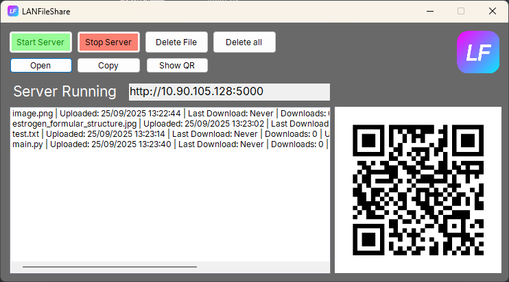
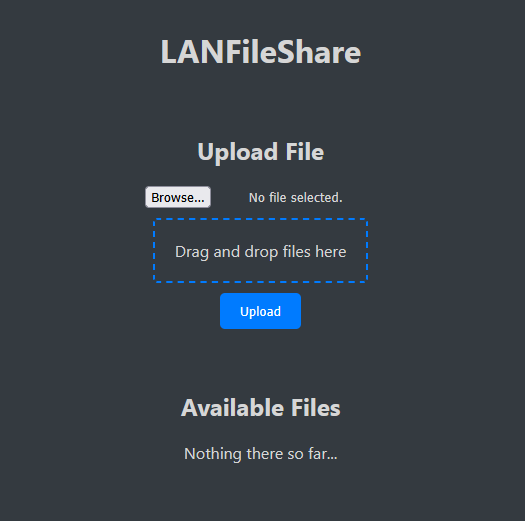

# LANFileShare

## A cool tool to easily share files on your local network. Written in C# using .NET Windows Forms

### Contents

- [Introduction](#introduction)
- [Features](#features)
- [Installation](#installation)
- [Usage](#usage)
- [Information](#information)

### Introduction

LANFileShare is a simple tool to share files on your local network. It uses .NET Windows Forms to create a user-friendly interface. The tool allows you to host a server on your local network and share files with others on the same network. The program uses a web interface that can easily be accessed by entering a link or scanning a QR code. The link is generated based on the machines IP address and a port.

It also is completely open-source and released under the MIT-License.
All icons used are from the [Must Have Icons](https://www.iconarchive.com/show/must-have-icons-by-visualpharm.html) icon set.

### Features

- **Easy to use**: The app has a simple and intuitive interface for both the Windows GUI and the webinterface that makes it easy to use.
- **File sharing**: Share files with others on your local network. It doesn't matter which operating system you are using, as long as it is connected to the same network and the hosts machine is running the server. For example, you can take a picture with your smartphone and share it with your Windows machine.
- **QR code**: Generate a QR code that can be scanned with your smartphone to access the web.
- **Link**: Generate a link that can be used to access the webinterface.
- **Webinterface**: The webinterface is accessible from any device that has a webbrowser and is connected to the same network as the server.

### Installation

To install the tool, download the latest release from the [GitHub repository](https://github.com/hasderhi/LANFileShare/releases). This will include the executable file and the source code. Please note that Windows Defender and/or other antivirus software may flag the executable as a threat. This is because the executable is not signed and I am not a verified publisher. You can safely ignore this warning and allow the executable to run. If you are still unsure, you can compile the source code yourself.

To do that, clone the repository and open the solution in Visual Studio. Then, you can build the project and run the executable. This will create a new executable file in the bin/Debug folder. The following depencies are required to compile the source code:

- .NET Framework 9
- Windows Forms
- Microsoft.AspNetCore.Mvc.Core
- Microsoft.AspNetCore.Server.Kestrel
- Newtonsoft.JsonResult
- QR-Coder

### Usage

To use the tool, follow these steps:

1. Run the executable file.
2. In the Windows GUI, click on the "Start Server" button.
3. A link will be generated which you can copy. You can also generate a QR-Code.
4. Open a webbrowser on any device on the same network and enter the link / Scan the QR-Code.
5. You will see a list of files that are currently shared on the server.
6. To upload a file, click on the "Upload File" button and select the file you want to upload. You can also drag-and-drop files onto the upload area.
7. To download a file, click on the file you want to download. This will start the download process. You may have to confirm the download in your webbrowser.

### Information

This tool is completely open-source and released under the MIT-License. All icons used are from the [Must Have Icons](https://www.iconarchive.com/show/must-have-icons-by-visualpharm.html) icon set. If you have any questions or need help, feel free to contact me on Github.

Copyright (c) 2025 Tobias Kisling ("tk_dev", "hasderhi")

# tk_dev - Software with passion!
